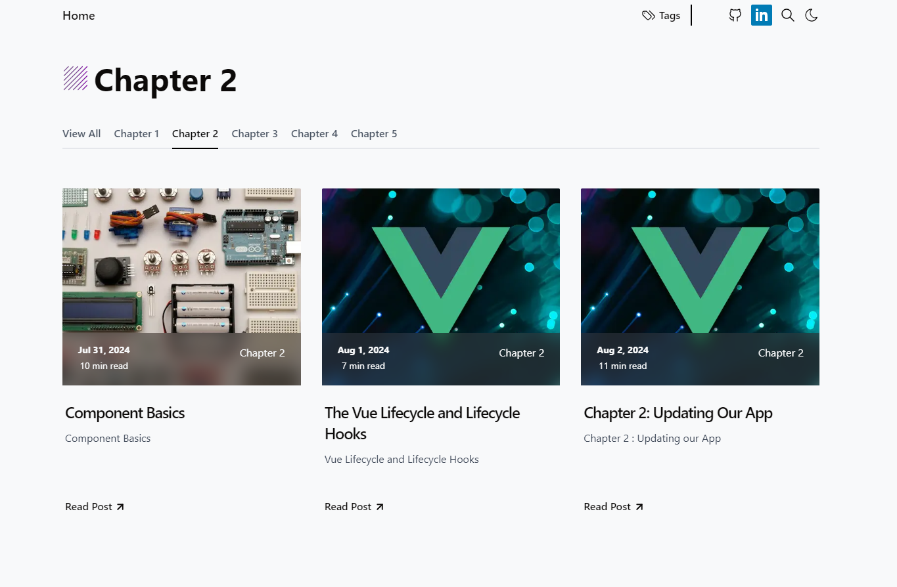

<h3 align="center">
 ⭐ Welcome to my Vue Js Blog!!! ⭐️
</h3>

## 📌 About the Project

With this project, I wanted to convey that I understand the core concepts behind the Vue Js frame work while avoiding just

copying someone elses project and adding it to my portfolio. I'll do that later 😂!!! The goal was to basically create a

Vue Js crash course, introducing all of the basics and showing how to use them through building a basic app.

## 💻 Live Site

Check out the [Live Site](https://astro-book-rating-app.vercel.app/), hosted on Vercel.
 
And the code in my github [here](https://github.com/mjay88/astro-book-rating-app)

## 👨‍🚀 Astro

I recently discovered Astro, and thought it was pretty cool and then wanted to build a blog with it. My set up comes

from this amazing template [here](https://github.com/danielcgilibert/blog-template?tab=readme-ov-file#-Features) and you

can find more awesome templates from the [astro folks here](https://astro.build/themes/)

## 🦙 Tina CMS

By default, this template came pre-configured with Tina CMS. I have never worked with any CMS before, but I must

say that Tina was so easy to use for development and I had no issues deploying using Tina Cloud. I'd highly recommend

it and will definitely be using it in the future.

You can read more about Tina CMS [here](https://tina.io/docs/)
